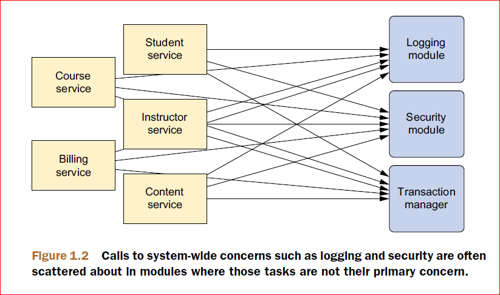
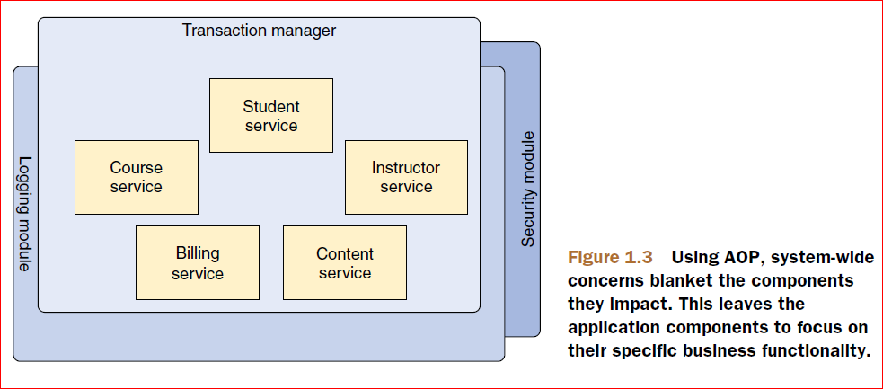

## **Spring的用途**
Spring被开发出来的目的：用来简化Java的开发

## **Spring采用的策略**
为了解决Java开发的复杂度，Spring采用了四种关键的技术：

◾ 使用POJOs进行轻量级的、低侵入式的开发

◾ 使用DI和面向接口技术去除耦合性

◾ 通过切面和通用转换进行声明式编程

◾ 使用切面和模板消除样板代码

**说明**：几乎所有Spring可以办到的事情都能追踪到这四种技术中的一种或多种

#### 1. **使用POJOs进行开发**

长时间使用java的人会知道许多框架通过强制要求用户继承某个类或实现某个接口的方式将用户
锁在框架中。

Spring避免了上面这种确定，不会强制用户去实现某个Spring接口或继承某个Spring类。Spring中定义的类中没有任何迹象会表明使用了Spring技术，最糟糕的情况下，类可能使用Spring注解进行了声明，即使这样，这个类仍然还是一个POJO。

#### 2. **依赖注入DI**

DI技术听起来感觉很深奥，实际上并没有那么复杂。将DI技术应用到项目中，你会发现你的代码变得特别简单，容易理解，并且容易调试。

#### 3. **使用切面AOP**

面向切面编程（AOP）将能帮助你捕捉将组件用到整个应用程序中的功能。

AOP技术是一种技术，用来将软件系统的关注点独立开来。系统是由许多组件构成的，每一个组件负责一个特定功能。但是经常这些组件中会包含一些核心功能之外的功能。比如说系统服务（如日志，事务管理和安全）经常分布在这些组件的代码中。这些系统服务通常叫做***横切面关注点****。如果在组件中**引入了这些横切面关注点，就会给代码带来两种层次的复杂度**：
1.  实现了系统级别关注点的代码会在多个组件中重复    
    这样，当需要修改这些关注点时，就需要一个组件一个组件地修改
2.  组件中充满了与核心功能不对齐的代码

这种复杂度如下所示：

而使用AOP技术后，所有的横切关注点就像毛毯一样，如下所示：

#### 4. **使用模板消除样板代码**

在Java API中有许多涉及到样板代码的地方。常用的一个例子是使用JDBC从数据库中查询数据。使用JDBC的步骤包括：创建数据连接, 然后创建statement,最后查询结果。而且需要使用try-catch语句捕获checked异常SQLException。当上面所有操作做完后需要释放资源,关闭连接、statement和结果集。

而使用Spring模板后，就可以消除样板代码。比如，Spring-JDBC中提供了JdbcTemplate类用来执行数据库操作, 从而没有像传统JDBC操作那样需要许多步骤。