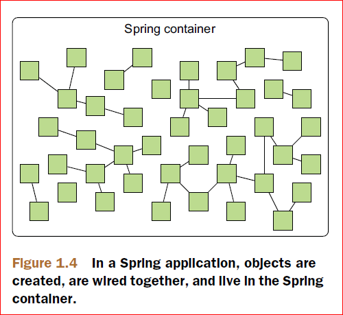
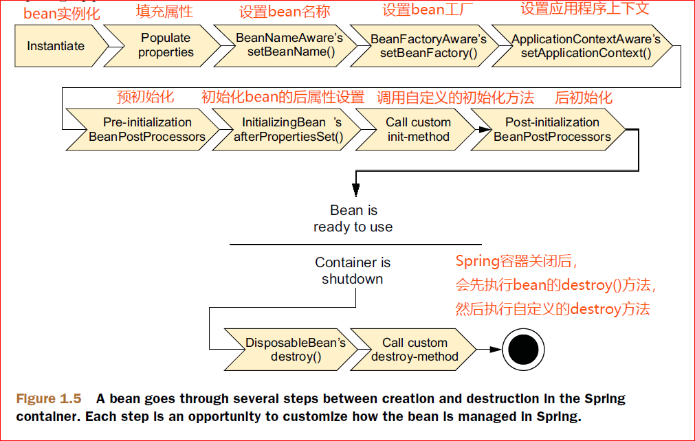

## **Spring容器**

在基于Spring的应用程序中，应用程序中的对象都保存在Spring容器中。
正如图1.4所展示的那样，Spring容器负责创建对象，装配它们，配置它们，并管理着这些对象的生命周期，从创建一直到消亡。

### 一、 **掌握Spring容器的重要性**

理解容器将会帮助我们掌握对象是怎样被管理的。

容器是Spring框架的核心。Spring中的容器使用DI技术管理应用中的组件。这包括在相关联的组件之间创建关联。

Spring中容器的实现可以分成两种不同的类型：Bean工厂和Application Context。

- **Bean**（由org.springframework.beans.factory.BeanFactory接口定义）是最简单的容器，提供了最基本的DI支持

- **Application Context**是基于bean工厂的概念来构建的，用来提供应用程序框架层的服务，比如解决属性文件中字符信息和将应用程序事件发布给相应的事件监听器的能力

一般情况下，会优先使用Application Contexts来解决问题。

### 二、 **使用Application Context**

Spring有好几个应用程序上下文（Application Context）:

●  **AnnotationConfigApplicationContext**：将从一个或多个Java配置类中加载Spring中的应用程序上下文

●  **AnnotationConfigWebApplicationContext**：将从一个或多个Java配置类中加载Spring中的web应用程序上下文

●  **ClassPathXmlApplicationContext**：将从一个或多个在classpath路径中的XML配置文件中加载应用程序上下文定义，会将上下文定义文件当作classpath路径下的资源

●  **FIleSystemXmlApplicationContext**：从文件系统的一个或多个XML文件中加载上下文定义

●  **XmlWebApplicationContext**：从web应用程序所包含的一个或多个XML文件中加载上下文定义

**说明**：

- 从文件系统（FileSystem）或从类路径（classpath）加载应用程序上下文与将bean加载到bean工厂的过程是相似的

- **FileSystemXmlApplicationContext**与**ClassPathXmlApplicationContext**之间的区别是前者会从文件系统的指定位置去加载xml配置文件，而后者会在classpath（包括JAR文件中）查找指定的xml配置文件

- 而不是指定XML文件来加载Spring应用程序上下文，使用AnnotationConfigApplicationContext可以使用指定的配置类来加载bean对象。

### 三、 **bean的生命周期**

理解Spring中bean的生命周期是很重要的，因为你可能希望利用Spring提供的某些机会来自定义bean被创建的过程。

在一个bean可以使用之前，需要执行一些设置步骤：

1.Spring实例化这个bean

2.Spring将值和其他bean引用注入到当前bean的属性中

3.如果bean实现了BeanNameAware，Spring会将bean的ID传给setBeanName()方法

4.如果bean实现了BeanFactoryAware，Spring会调用setBeanFatory()方法，并将bean工厂的自身的引用传到这个方法中去

5.如果bean实现了ApplicationContextAware，Spring会调用
SetApplicationContext()方法，并将对某个封闭的应用程序的引用传到这个方法中去

6.如果bean实现了BeanPostProcessor接口，Spring会调用这个接口中的postProcessBeforeInitialization()方法

7.如果bean实现了InitializingBean接口，Spring会调用它的afterPropertiesSet()方法。同样地，如果bean中定义了initMethod方法，将会调用这个初始化方法

8.如果bean实现了BeanPostProcessor接口，Spring会调用这个接口中的postProcesAfterInitialization()方法

9.上述步骤完成后，bean就可以被应用程序使用了，并会一直保存在Application Context中，直到Application Context被销毁

10.如果bean实现了DisposableBean接口，Spring会调用这个接口中的destroy()方法。同样地，如果bean中定义了自定义的destroy方法，将会调用这个方法